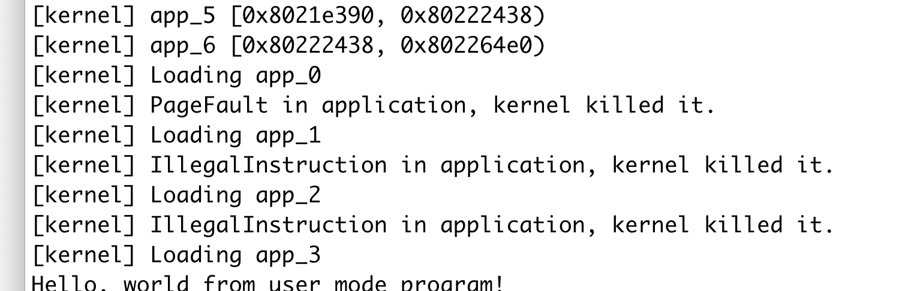

# 总结实现功能

实现了一个系统调用`sys_task_info`用于查询正在执行的任务的信息。在`TCB`中加入了两个field，分别记录每个系统调用的调用次数和第一次被调度的时刻。

在syscall的入口处为对应的系统调用增加次数，在TaskManager中为下一个执行的任务记录当前时间（如果之前没记录过）。在处理这个系统调用的时候算出当前时间和记录时间的差值。

在TaskManager中加入了一个函数，用于访问当前任务的`TCB`。

# 简答1

## 使用的`RustSBI`版本
0.4.0-alpha.1

## 出错行为

内核会输出以上内容。

U态下使用S态指令会触发异常，然后内核会在其handler中输出对应的信息。

`bad_address`访问了空指针，触发了`StoreFault`。

`bad_instruction`执行了特权指令，触发了`IllegalInstruction`

`bad_register`访问了特殊的寄存器，也触发了`IllegalInstruction`

# 简答2

## 2.1

如果`__restore()`是直接从上面`__alltraps()`掉下来的，那`a0`中是当前进程在之前保存的`TaskContext`。这个情况是在触发了一个trap的时候，`mv a0, sp`把当前的`sp`放到`a0`里，然后调用`trap_handler()`返回以后会直接掉下来到`__restore()`，这个函数的返回值和参数一样，然后就可以用`__restore()`恢复之前的栈的状态，然后返回到用户态。

如果`__restore()`是从`TaskContext::goto_restore()`生成的context中进入的，那刚进来的时候`a0`中是上一个进程的`TaskContext`。`TaskContext::goto_restore()`会把`TaskContext`中的`ra`填上`__restore()`的地址，然后在`__switch()`时将`TaskContext::ra`给`ra`寄存器，一返回就会进入`__restore()`。在`__switch()`中并没有修改`a0`的值，所以在`__restore()`的开头`a0`的值还是刚才调用`__switch()`时的第一个参数，也就是`current_task_cx_ptr`，就是这个刚才被切换出来的进程的`TaskContext`，也就是上一个执行进程的。

## 2.2

处理了`sstatus`，`sepc`和`sscratch`。

### `sstatus`

这个寄存器里的值会控制比如允不允许中断这样的东西，比如返回到用户态以后要把中断打开，要不然下一次没法再中断了。还有其他的一些作用。

### `sepc`

这个值要设成我们想要返回的地址。如果发生trap的指令是一条`ecall`，返回的时候要跳到下一条指令去执行，要不然会发生死循环。如果发生trap的原因是时钟中断，那返回的时候这条指令还要再执行。所以要把返回的位置给回去。

### `sscratch`

记录了内核栈的地址，回到用户态，下次再trap的时候使用。在这个位置因为我们可能是从不同的进程切换过来的，所以要把内核栈换成当前进程的内核栈，防止把其他进程的内核栈里的内容给写掉了。

## 2.3

`x2`就是`sp`，`sp`被放到`a0`里保存了。

`x4`目前用不到，所以没保存（#21有写）

## 2.4

`sp`中是当前进程的用户栈，`sscratch`中是如果trap的时候，要切换到的内核栈。

## 2.5

`sret`

这条指令是用来从S态返回的。`sstatus`寄存器中的`spp`位记录了中断之前处于哪个态。我们之前保存的`spp`中的值表示我们之前是从U态来的，所以就会发生切换。

## 2.6

`sp`中是当前进程的内核栈，`sscratch`中是先前用户态时的用户栈。

## 2.7

是用户态程序在实现系统调用的时候用的`ecall`。也有可能是在用户态执行了一些权限不够的指令，或者是访问一些非法的内存的时候发生的trap。

# 荣誉准则

1. 在完成本次实验的过程（含此前学习的过程）中，我曾分别与 以下各位 就（与本次实验相关的）以下方面做过交流，还在代码中对应的位置以注释形式记录了具体的交流对象及内容：

无

2. 此外，我也参考了 以下资料 ，还在代码中对应的位置以注释形式记录了具体的参考来源及内容：

无

3. 我独立完成了本次实验除以上方面之外的所有工作，包括代码与文档。 我清楚地知道，从以上方面获得的信息在一定程度上降低了实验难度，可能会影响起评分。

4. 我从未使用过他人的代码，不管是原封不动地复制，还是经过了某些等价转换。 我未曾也不会向他人（含此后各届同学）复制或公开我的实验代码，我有义务妥善保管好它们。 我提交至本实验的评测系统的代码，均无意于破坏或妨碍任何计算机系统的正常运转。 我清楚地知道，以上情况均为本课程纪律所禁止，若违反，对应的实验成绩将按“-100”分计。
